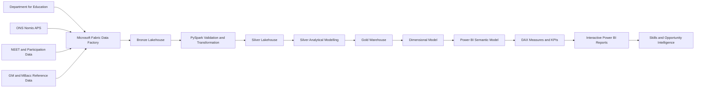
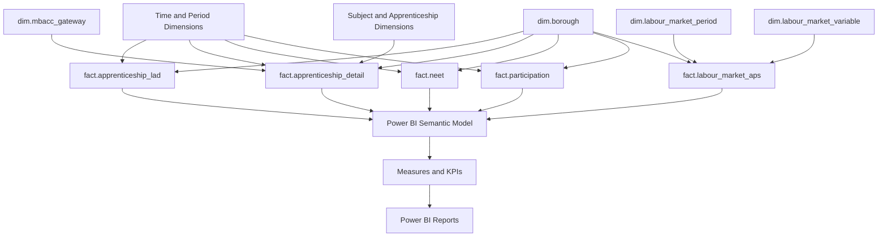
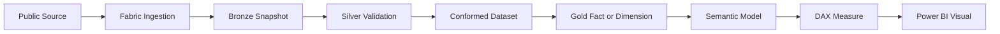
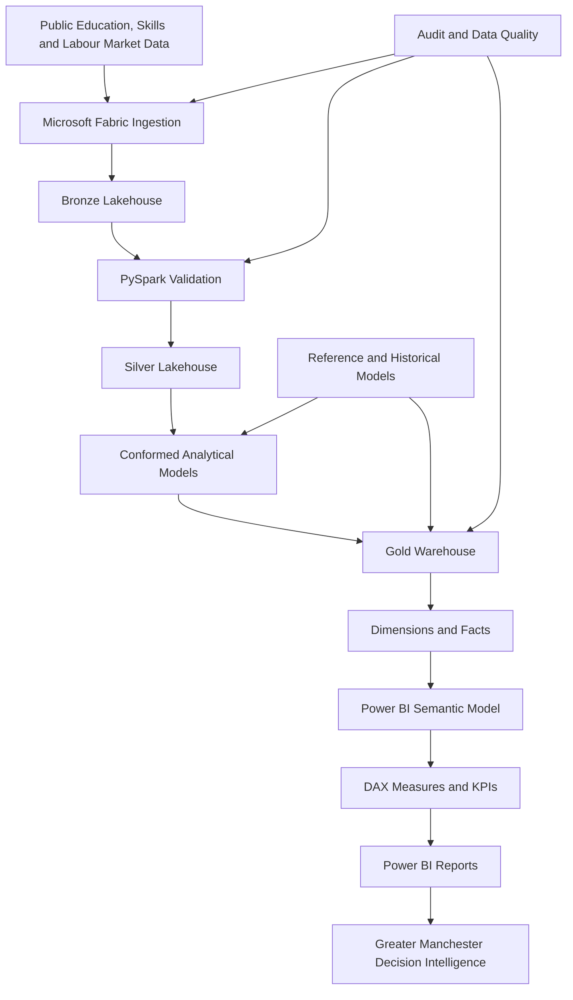

# Power-BI-Analytics-and-Semantic-Modelling---GM-SkillsFlow-Skills-Opportunity-Intelligence


# Power BI Analytics and Semantic Modelling

## GM SkillsFlow | Skills & Opportunity Intelligence


## SCHEMA 1


## SCHEMA 2


## From Public Data to Decision Intelligence

Power BI does not connect directly to each source dataset.

The information shown in the report travels through several controlled stages before becoming available for analysis.

The overall journey is:

```text
Public Data Sources
        |
        v
Automated Ingestion
        |
        v
Bronze Lakehouse
        |
        v
Validation and Profiling
        |
        v
Silver Lakehouse
        |
        v
Conformed Analytical Data
        |
        v
Silver Business Modelling
        |
        v
Gold Warehouse
        |
        v
Dimensional Model
        |
        v
Power BI Semantic Model
        |
        v
DAX Measures and KPIs
        |
        v
Interactive Power BI Reports
        |
        v
Greater Manchester Skills and Opportunity Intelligence
```

This architecture separates data acquisition from data interpretation.

It also ensures that Power BI is not responsible for repeatedly cleaning and restructuring raw datasets.

Instead, Power BI receives data that has already been validated, governed and prepared for analytical use.


#  Semantic Model Design Principles

The semantic model was designed around reusable dimensions and subject specific facts.

The general principle follows a star schema approach.

```text
                  Borough
                     |
                     |
                     v
Time ----------- Fact Table ----------- Category
                     |
                     |
                     v
                Classification
```

For example, several reporting areas can share the same borough dimension.

This means that a single borough selection can filter:

* Employment
* Apprenticeships
* NEET
* Participation
* Other related measures

The semantic model therefore provides a common analytical language across different subject domains.

Its purpose is not simply to expose database tables.

Its purpose is to translate the physical warehouse model into a structure that is intuitive for business intelligence.

---

# Measures Before Visuals

An important design principle is that important business calculations should be defined centrally wherever possible.

The report uses semantic measures for concepts such as:

```DAX
Latest Employment Rate (%)

Latest Economic Inactivity Rate (%)

Latest Apprenticeship Starts

Latest Apprenticeship Achievements

Latest NEET Rate

Average Employment Rate (%)
```

The analytical sequence is:

```text
Warehouse Data
      |
      v
Relationships
      |
      v
Semantic Measures
      |
      v
Power BI Visuals
```

This is preferable to embedding independent calculations into each chart.

A centrally defined measure provides:

* Consistency
* Reusability
* Easier maintenance
* Easier testing
* Clearer business definitions
* Reduced duplication

If the definition of a KPI changes, it can be corrected centrally rather than modifying every visual independently.

---

**GM SkillsFlow** is an end to end data intelligence platform designed to connect education, apprenticeships, youth participation, skills pathways and labour market opportunity across the ten boroughs of Greater Manchester.

The Power BI component represents the analytical and decision intelligence layer of the wider platform. It is not a standalone dashboard connected directly to raw files. Instead, the report sits at the end of a governed Microsoft Fabric data engineering architecture that collects public data, preserves source records, validates and transforms them, builds dimensional analytical models, creates a Gold Warehouse, exposes the resulting structures through a semantic model, and finally delivers interactive business intelligence through Power BI.

The platform was developed to answer questions such as:

* How do employment conditions vary across Greater Manchester?
* Which boroughs have stronger or weaker employment rates?
* Where is economic inactivity highest?
* How do apprenticeship starts differ across boroughs?
* How do apprenticeship starts compare with achievements?
* Which areas have higher NEET or Not Known rates?
* How have Greater Manchester labour market conditions changed over time?
* How can education and training participation be analysed alongside employment outcomes?
* How can Greater Manchester Baccalaureate pathways be incorporated into regional skills intelligence?
* How can multiple public datasets be converted into a governed and reusable analytical platform?

The Power BI report therefore represents the visible analytical output of a much larger data engineering, data quality, dimensional modelling and semantic modelling workflow.

---

The current Power BI executive overview brings together labour market, apprenticeship and youth transition indicators into a single Greater Manchester intelligence view.

The current dashboard provides headline indicators for:

* Employment Rate
* Economic Inactivity Rate
* Apprenticeship Starts
* NEET and Not Known Rate

It also provides analytical views for:

* Employment Rate by Borough
* Apprenticeship Starts and Achievements by Borough
* NEET and Not Known Rate by Borough
* Historical Employment Trends
* Borough level filtering across the report

The screenshot represents only the final presentation layer.

Before these figures reach Power BI, they have already passed through automated ingestion, Bronze storage, Silver validation, data transformation, business modelling, Gold dimensional modelling and semantic preparation.

The current report therefore demonstrates the final stage of an integrated analytical engineering platform rather than a dashboard created directly from source spreadsheets.

---

# 2. Project Overview

GM SkillsFlow was developed as a Greater Manchester Skills and Opportunity Intelligence Platform.

The central idea behind the project is that education, apprenticeships, youth participation and labour market indicators should not be analysed as completely separate subjects.

They are connected.

Skills development influences employability.

Education and apprenticeship participation influence future labour supply.

NEET outcomes provide insight into young people's transition into education, training and employment.

Employment and economic inactivity provide evidence about the wider labour market.

Subject pathways and apprenticeship classifications provide information about the types of skills being developed.

The project therefore creates a single analytical environment capable of bringing these different areas together.

The major analytical domains are:

### Labour Market Intelligence

Includes indicators such as:

* Employment
* Economic inactivity
* Labour market participation
* Historical labour market trends

### Apprenticeship Intelligence

Includes:

* Apprenticeship starts
* Apprenticeship achievements
* Apprenticeship levels
* Subject areas
* Borough level apprenticeship patterns

### Youth Transition Intelligence

Includes:

* NEET rates
* Not Known classifications
* Education and training participation
* Borough level youth transition indicators

### Skills Pathway Intelligence

Includes:

* Sector Subject Areas
* Education pathways
* Apprenticeship subjects
* Greater Manchester Baccalaureate gateway mapping

### Geography Intelligence

Provides a consistent analytical view across the ten Greater Manchester boroughs:

* Bolton
* Bury
* Manchester
* Oldham
* Rochdale
* Salford
* Stockport
* Tameside
* Trafford
* Wigan

The project converts these separate domains into a common data platform so that they can be analysed consistently.

---


---

# 4. Source Data Domains

GM SkillsFlow integrates several public data domains.

## Department for Education

Department for Education data contributes information relating to areas such as:

* Apprenticeship starts
* Apprenticeship achievements
* Apprenticeship levels
* Subject areas
* Education participation
* Youth transition indicators

## ONS Nomis

ONS Nomis provides labour market information used within the platform.

The Annual Population Survey data supports measures including:

* Employment
* Economic inactivity
* Labour market indicators
* Historical labour market trends

## NEET and Participation Data

Youth participation information supports analysis of:

* Young people who are Not in Education, Employment or Training
* Not Known classifications
* Education participation
* Training participation
* Borough level youth transition conditions

## Greater Manchester Reference Data

Reference data provides the common structures needed to integrate the different source datasets.

Examples include:

* Greater Manchester boroughs
* Subject classifications
* Apprenticeship classifications
* Skills pathway mappings
* MBacc gateway classifications

## Greater Manchester Baccalaureate

The Greater Manchester Baccalaureate component provides a pathway based structure that can be used to relate education and subject areas to future skills requirements.

This allows the platform to move beyond isolated statistics and towards a broader skills pathway intelligence model.

---

# 5. End to End Platform Architecture

The complete analytical architecture can be represented as follows:



Each layer has a clear responsibility.

The design deliberately avoids mixing raw data storage, transformation logic and visual reporting into the same layer.

This makes the platform easier to maintain, audit, test and extend.

---

# 6. Microsoft Fabric Pipeline Orchestration

Microsoft Fabric is used to orchestrate the movement of data through the analytical platform.

The project follows a staged pipeline architecture.

Conceptually, the workflow is:

```text
Source Ingestion
      |
      v
Bronze
      |
      v
Bronze to Silver
      |
      v
Silver Modelling
      |
      v
Silver to Gold
      |
      v
Gold Warehouse
      |
      v
Semantic Model
      |
      v
Power BI
```

The Fabric pipeline architecture separates ingestion from downstream modelling.

Important workflow stages include processes for:

* Source ingestion
* DfE ingestion
* Nomis ingestion
* Bronze to Silver transformation
* Silver modelling
* Silver to Gold publication
* Gold dimensional model construction
* Data quality verification
* Reporting refresh

A major pipeline used during the project is:

`pl_silver_to_gold`

This stage is responsible for promoting validated and modelled Silver data into the curated Gold analytical structures used by downstream reporting.

The use of separate pipeline stages also makes troubleshooting safer.

For example, a Gold transformation can be tested independently before triggering the complete Production refresh.

---

# 7. Bronze Layer

The Bronze layer acts as the raw landing zone for the platform.

The Bronze Lakehouse preserves source data as close as possible to the state in which it was received.

The purpose of the Bronze layer is not to create reporting ready information.

Its purpose is to preserve evidence.

Typical responsibilities include:

* Preserving downloaded source snapshots
* Retaining source level information
* Capturing ingestion metadata
* Supporting reproducibility
* Separating raw data from transformed data
* Allowing transformations to be rerun when business rules change
* Providing an audit trail back to the original source

The architectural principle is:

```text
External Source
      |
      v
Ingestion Pipeline
      |
      v
Bronze Snapshot
```

This provides an important safeguard.

If downstream logic changes, the original data does not need to be downloaded again.

The transformation process can be repeated from the preserved Bronze source.

---

# 8. Silver Layer

The Silver layer provides the validated, standardised and conformed analytical staging area.

Raw datasets coming from different organisations rarely share identical structures.

They may use different:

* Column names
* Data types
* Geographic identifiers
* Reporting periods
* Category definitions
* Missing value conventions
* Special value codes
* Publication structures

The Silver layer resolves these inconsistencies before the information is promoted to Gold.

Typical Silver transformations include:

```text
Raw Source
     |
     v
Schema Validation
     |
     v
Type Standardisation
     |
     v
Data Quality Checks
     |
     v
Greater Manchester Filtering
     |
     v
Borough Normalisation
     |
     v
Period Standardisation
     |
     v
Special Value Handling
     |
     v
Category Harmonisation
     |
     v
Reference Mapping
     |
     v
Conformed Silver Data
```

Python and PySpark are used extensively within this stage.

The Silver layer therefore acts as the bridge between source specific structures and the common analytical model used later in the platform.

---

# 9. Data Quality and Validation

Data quality is treated as part of the platform architecture rather than something performed manually after a dashboard appears incorrect.

Validation occurs before data reaches the reporting layer.

Checks may include:

* Required column validation
* Schema checks
* Null detection
* Duplicate detection
* Data type validation
* Geographic validation
* Expected row count checks
* Category validation
* Date and period validation
* Reference mapping validation
* Business rule validation

The principle is:

```text
Ingest
  |
  v
Validate
  |
  v
Transform
  |
  v
Reconcile
  |
  v
Publish
```

Data should not move into the next analytical layer simply because a pipeline technically completed.

It should also satisfy expected analytical conditions.

This provides much stronger confidence in the Power BI figures.

---

# 10. Gold Analytical Warehouse

The Gold layer represents the curated analytical layer of GM SkillsFlow.

The Gold Warehouse contains structures specifically designed for reporting and analysis.

Rather than exposing large source shaped tables directly to Power BI, the project creates reusable dimensions and facts.

The Gold environment is organised conceptually around schemas including:

```text
ctl
audit
hist
dim
fact
mart
```

These schemas have different purposes.

## `ctl`

Stores operational control and configuration information.

## `audit`

Stores pipeline and data quality audit information.

## `hist`

Supports historical configuration and change tracking.

## `dim`

Contains analytical dimensions.

## `fact`

Contains measurable analytical events and observations.

## `mart`

Can expose business facing analytical structures optimised for downstream consumption.

This structure keeps operational metadata separate from business facts and dimensions.

---

# 11. Dimensional Modelling

The Gold Warehouse uses dimensional modelling principles.

This creates reusable analytical entities that can participate across multiple subject areas.

Important dimensions developed within the project include structures such as:

* `dim.borough`
* `dim.mbacc_gateway`
* `dim.ssa_subject`
* `dim.time_period`
* `dim.apprenticeship_level`
* `dim.labour_market_period`
* `dim.labour_market_variable`

Important fact structures include:

* `fact.apprenticeship_lad`
* `fact.apprenticeship_detail`
* `fact.neet`
* `fact.participation`
* `fact.labour_market_aps`

The relationship can be understood as:

```text
                  dim.borough
                       |
                       |
                       v
dim.time ------ Fact Tables ------ dim.subject
                       |
                       |
                       v
              dim.mbacc_gateway
```

This approach avoids repeatedly storing descriptive information inside every fact table.

Instead, reusable dimensions provide analytical context.

---

# 12. Labour Market Dimensional Model

The labour market component uses governed dimensions to separate reporting periods and labour market variables from the fact observations.

The conceptual structure is:

```text
dim.labour_market_period
           |
           |
           v
fact.labour_market_aps
           ^
           |
           |
dim.labour_market_variable
```

The labour market period dimension includes information such as:

* Reporting period
* Period name
* Period code
* Period type
* Sort order
* Model run identifier
* Modelled timestamp
* Analytical period date

A true `period_date` field was introduced so that Power BI receives a real date value rather than relying entirely on textual period labels.

For example:

```text
Source Period
2004-12

Analytical Date
2004-12-01
```

This creates a genuine chronological field that Power BI can use for:

* Correct time ordering
* Continuous time series
* Date based filtering
* Historical analysis
* Future time intelligence measures

This is a good example of why report requirements sometimes drive improvements in the upstream analytical model.

---

# 13. Slowly Changing Dimensions and Historical Integrity

Some analytical reference data can change over time.

Simply overwriting the old value would destroy historical context.

GM SkillsFlow therefore incorporates Slowly Changing Dimension principles where historical preservation is required.

A typical Type 2 pattern can be represented as:

```text
Business Key
     |
     v
Surrogate Key
     |
     v
Attribute Values
     |
     v
Row Hash
     |
     v
Valid From
     |
     v
Valid To
     |
     v
Is Current
```

This allows the platform to preserve the version of a classification that was valid at a particular point in time.

Historical modelling is especially valuable where:

* Reference mappings change
* Classification definitions change
* Pathways are updated
* Configuration changes
* Business mappings evolve

This protects historical analytical integrity.

---

# 14. Auditability and Governance

The project includes explicit operational and quality controls.

Examples of governance structures include:

```text
ctl.source_config

hist.source_config

audit.pipeline_run

audit.data_quality_result
```

These structures help answer questions such as:

* Which source was used?
* When was the data ingested?
* Which pipeline processed the dataset?
* Was the pipeline successful?
* Did the data pass quality checks?
* How many rows were processed?
* Which model run produced the current Gold data?
* Has a source configuration changed?
* Which reference mapping was active?

This is important because an analytical dashboard should not become a collection of figures without provenance.

The platform is designed so that reported information can be traced back through the engineering workflow.

---

# 15. Gold to Power BI Semantic Model

The Gold Warehouse is not the final layer.

Power BI consumes the curated analytical structures through a semantic model.

The semantic model acts as the analytical contract between the warehouse and the report.

The flow is:



The semantic model provides:

* Table relationships
* Analytical hierarchies
* Business friendly field names
* Reusable measures
* Filter behaviour
* Date relationships
* Geography relationships
* Reporting consistency

This prevents individual visuals from becoming responsible for defining their own analytical logic.

---


# 18. Current Executive Overview

The current Power BI page provides a high level Greater Manchester executive overview.

At the time of the current dashboard screenshot, the headline cards show:

### Employment Rate

**71.5%**

This represents the latest employment rate available within the current semantic model context.

### Economic Inactivity Rate

**24.8%**

This provides an indication of the proportion of the relevant population classified as economically inactive.

### Apprenticeship Starts

**16,990**

This represents the latest apprenticeship starts measure within the current report context.

### NEET and Not Known

**4.3%**

This provides the latest NEET and Not Known indicator used in the report.

These values should not be interpreted as manually typed dashboard statistics.

They are outputs generated through the underlying model and semantic measures.

---

# 19. Borough and Trend Intelligence

The current Power BI report contains several important analytical perspectives.

## Employment Rate by Borough

The employment visual compares Greater Manchester boroughs and makes geographic variation immediately visible.

It allows users to identify differences across boroughs such as:

* Trafford
* Manchester
* Stockport
* Tameside
* Wigan
* Salford
* Bury
* Bolton
* Rochdale
* Oldham

The intention is not merely to rank areas.

The borough dimension provides a common geographic filter that can be applied across several analytical domains.

## Apprenticeship Starts and Achievements

The apprenticeship visual compares:

* Latest Apprenticeship Starts
* Latest Apprenticeship Achievements

by borough.

This provides more analytical context than displaying starts alone.

A large number of starts indicates entry into apprenticeship provision.

Achievement information provides an additional view of completed apprenticeship outcomes.

Bringing these measures together supports a wider conversation about participation, progression and skills development.

## NEET and Not Known by Borough

The NEET visual provides a borough level comparison of youth transition outcomes.

This is important because headline labour market indicators alone cannot explain how young people are transitioning between:

* Education
* Training
* Employment
* NEET status
* Unknown destinations

The measure can therefore be considered alongside apprenticeship and participation information.

## Employment Trends

The historical employment visual adds a time dimension to the latest employment KPI.

Instead of showing only the current figure, the report provides a longer term view of labour market movement.

This makes it possible to observe:

* Historical decline
* Recovery
* Periods of stability
* Recent movements
* Longer term regional trends

The `period_date` field in the Gold labour market period dimension provides the chronological foundation for this visual.

---

# 20. Report Interaction and Analytical Navigation

The report is designed to move from regional overview to local investigation.

The analytical journey can be represented as:

```text
Greater Manchester Overview
            |
            v
Select Borough
            |
            v
Employment Conditions
            |
            v
Economic Inactivity
            |
            v
Apprenticeship Starts
            |
            v
Apprenticeship Achievements
            |
            v
NEET and Participation
            |
            v
Historical Trends
```

The Borough Name slicer acts as a shared analytical context.

Selecting a borough can change multiple visuals simultaneously because the semantic model connects the borough dimension to the relevant fact tables.

This is one of the major benefits of building a semantic model before designing the report.

The dashboard does not require ten separate copies for the ten boroughs.

One governed model supports interactive exploration across all areas.

---

# 21. Data Lineage and Separation of Responsibilities

One of the strongest architectural principles in GM SkillsFlow is the separation of storage, transformation, analytical logic and presentation.

A typical Power BI value follows this route:



For example, an employment rate displayed in Power BI does not originate directly from the visual.

It originates from a labour market source.

The source is ingested and preserved.

The data is validated and standardised.

The analytical period and variable structures are modelled.

The resulting data enters the Gold Warehouse.

Relationships are created within the semantic model.

A reusable measure is defined.

Only then is the result presented within Power BI.

This separation can also be expressed as three major responsibilities.

## Storage

Responsible for preserving data at different levels of maturity.

```text
Bronze
  |
  v
Silver
  |
  v
Gold
```

## Analytical Logic

Responsible for defining what the data means.

This includes:

* Python
* PySpark
* SQL
* Reference mapping
* Dimensional modelling
* Business rules
* Semantic relationships
* DAX measures

## Presentation

Responsible for communicating the resulting intelligence.

This includes:

* KPI cards
* Borough comparisons
* Trend charts
* Interactive filters
* Executive reporting

This separation means that a change in chart style does not require redesigning the raw ingestion pipeline.

Similarly, an improvement to backend data validation can propagate automatically to downstream analytics.

---

# 22. Reproducibility, Technology Stack and Repository Structure

The Power BI work forms part of a version controlled engineering project rather than existing only as a local Power BI file.

The repository can maintain assets such as:

```text
greater-manchester-skills-opportunity-intelligence/
|
|-- docs/
|   |
|   |-- power-bi.md
|
|-- assets/
|   |
|   |-- powerbi/
|       |
|       |-- gm-skillsflow-overview.png
|
|-- fabric/
|   |
|   |-- notebooks/
|   |-- pipelines/
|   |-- semantic-model/
|
|-- sql/
|   |
|   |-- ddl/
|   |-- dimensions/
|   |-- facts/
|   |-- views/
|   |-- quality/
|   |-- governance/
|
|-- powerbi/
|
|-- tests/
|
|-- README.md
```

The exact repository structure can evolve, but the important principle is that the reporting artefacts remain connected to the engineering work that produces them.

## Technology Stack

The complete solution demonstrates the use of:

### Data Sources

* Department for Education
* ONS Nomis
* Greater Manchester reference data
* MBacc related reference data
* Youth participation and NEET data

### Data Engineering

* Python
* PySpark
* SQL
* Microsoft Fabric

### Orchestration

* Microsoft Fabric Data Factory
* Fabric Pipelines

### Storage

* Microsoft Fabric Lakehouse
* Bronze data architecture
* Silver data architecture

### Analytical Storage

* Microsoft Fabric Warehouse
* Gold analytical model

### Modelling

* Dimensional modelling
* Fact and dimension design
* Slowly Changing Dimension patterns
* Surrogate keys
* Reference mapping
* Historical configuration

### Governance

* Pipeline auditing
* Data quality controls
* Source configuration
* Historical configuration
* Model run identifiers
* Reconciliation checks

### Business Intelligence

* Power BI
* Power BI Semantic Model
* DAX
* Interactive reporting
* Time series analysis
* Geographic analysis

### Development and Version Control

* Git
* GitHub

The project therefore demonstrates a much broader technical capability than Power BI visualisation alone.

---

# 23. What the Power BI Layer Demonstrates

The Power BI layer represents the final analytical expression of the GM SkillsFlow platform.

The complete project journey can be summarised as:

```text
Public Data
     |
     v
Automated Ingestion
     |
     v
Source Preservation
     |
     v
Bronze Lakehouse
     |
     v
Data Validation
     |
     v
PySpark Transformation
     |
     v
Silver Lakehouse
     |
     v
Data Conformance
     |
     v
Reference Mapping
     |
     v
Business Modelling
     |
     v
Gold Warehouse
     |
     v
Dimensional Modelling
     |
     v
Data Quality Reconciliation
     |
     v
Semantic Modelling
     |
     v
DAX Measures
     |
     v
Power BI
     |
     v
Greater Manchester Skills and Opportunity Intelligence
```

The Power BI dashboard is therefore not the project itself.

It is the final consumption layer of a larger engineering system.

The platform demonstrates how heterogeneous public datasets can be transformed into governed and reusable decision intelligence.

It combines:

**Data Engineering**

with

**Data Quality**

with

**Data Governance**

with

**Dimensional Modelling**

with

**Semantic Modelling**

with

**Business Intelligence**

The current dashboard demonstrates an integrated executive view across:

* Employment
* Economic inactivity
* Apprenticeship starts
* Apprenticeship achievements
* NEET and Not Known
* Greater Manchester borough comparison
* Historical labour market trends

The underlying architecture is capable of supporting much more than the current executive page.

Future analytical pages can extend the same model into areas such as:

* Detailed apprenticeship intelligence
* Apprenticeship level analysis
* Sector Subject Area analysis
* MBacc gateway analysis
* Education participation
* Youth transition analysis
* Borough profiles
* Skills supply analysis
* Cross borough benchmarking
* Historical labour market comparison
* Education to employment pathway analysis
* Skills and opportunity alignment

The important point is that these future reports do not require a completely new backend.

They can reuse the existing:

```text
Ingestion
   +
Bronze
   +
Silver
   +
Gold
   +
Dimensions
   +
Facts
   +
Semantic Model
```

This is one of the principal architectural benefits of the project.

The reporting layer can continue to evolve while the platform maintains a consistent foundation underneath it.

---

## Final Architecture Summary



---

## Project Design Philosophy

GM SkillsFlow follows one central principle:

> **Build the data foundation first, define the analytical meaning second, and visualise only after the data is governed and reusable.**

Power BI therefore sits at the end of the pipeline rather than becoming the location where all transformation logic is hidden.

This improves:

* Data quality
* Maintainability
* Reproducibility
* Traceability
* Analytical consistency
* Scalability
* Reusability
* Governance

The result is a Power BI reporting layer backed by a complete data engineering and analytical modelling architecture.

---

## GM SkillsFlow 


**Greater Manchester Skills & Opportunity Intelligence**


**Education → Skills → Apprenticeships → Youth Participation → Labour Market Opportunity**

through:

**Microsoft Fabric → Lakehouse → Warehouse → Semantic Model → Power BI**

to create a reusable regional skills and opportunity intelligence platform.
